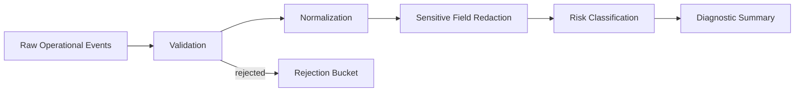

# Architecture

## System view

## Components

| Component | Responsibility |
|---|---|
| `event` | Defines raw and normalized event contracts, including `correlation_id` for cross-service tracing |
| `pipeline` | Validates, normalizes, and scores events; exposes both fail-fast and partial-success batch modes |
| `redaction` | Removes sensitive values before downstream processing |
| `summary` | Produces deterministic diagnostic rollups with stable severity keys |
| `main` | Provides a minimal CLI entrypoint using structured `anyhow` error propagation |

## Design stance

The project treats observability as a data-safety problem, not only a logging problem. Events should be useful during incidents, but they should not leak secrets or become unstructured noise.

## Batch normalization: fail-fast vs. partial-success

Two normalization strategies are exposed deliberately:

| Function | Behavior | Use when |
|---|---|---|
| `normalize_events` | Stops at the first invalid event and returns its error | The caller requires an all-or-nothing guarantee (e.g., a transactional sink) |
| `normalize_events_lenient` | Collects all valid events; paired rejected events are returned separately | The caller prefers maximum throughput and can log/re-queue rejections independently |

Silently discarding invalid events is never an option — the caller always receives explicit feedback on what was rejected and why.

## Risk scoring

Risk score is an additive model capped at 100:

| Signal | Contribution |
|---|---|
| Severity (`info` → `critical`) | 10 / 35 / 70 / 95 base |
| Failure result (`denied`, `failed`, `timeout`, `rejected`) | +10 |
| Anonymous actor (`actor_id` is `None`) | +5 |

This model is intentionally simple and auditable. It does not use machine learning.

## Production extensions

- Schema registry for event contracts and versioned schemas
- Sink adapters for Kafka, object storage, or SIEM platforms
- Policy-based redaction driven by a configuration store
- Deduplication using `event_id` and `correlation_id` correlation
- Incident timelines stitched from `correlation_id` across services
- Service dependency inference from event flows
- Event replay for incident post-mortems
