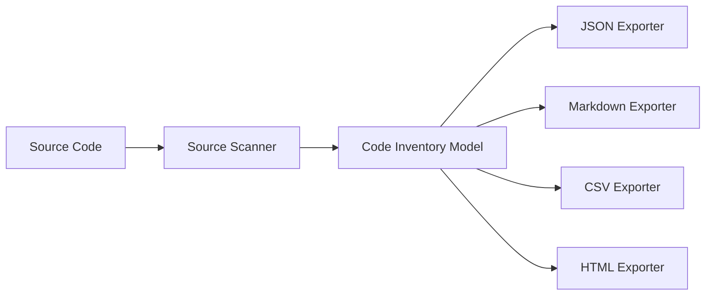

# Architecture

## System view

## Component responsibilities

| Component | Responsibility |
|---|---|
| CLI | Parses commands, validates input, orchestrates scan/export |
| Core | Owns source scanning and normalized inventory models |
| Exporters | Converts the inventory model into reviewable artifacts |
| Samples | Provide deterministic input for demos and tests |

## Architectural stance

The central design decision is that the inventory model is the stable contract. Scanners can evolve, exporters can be added, and the CLI can gain commands without making output formats dependent on implementation details.

## Extension points

- Replace lightweight regex scanning with Roslyn-based semantic analysis.
- Add dependency graph extraction.
- Add SQL/data-access inventory.
- Add OpenAPI generation.
- Add runtime traces and call-stack correlation.
