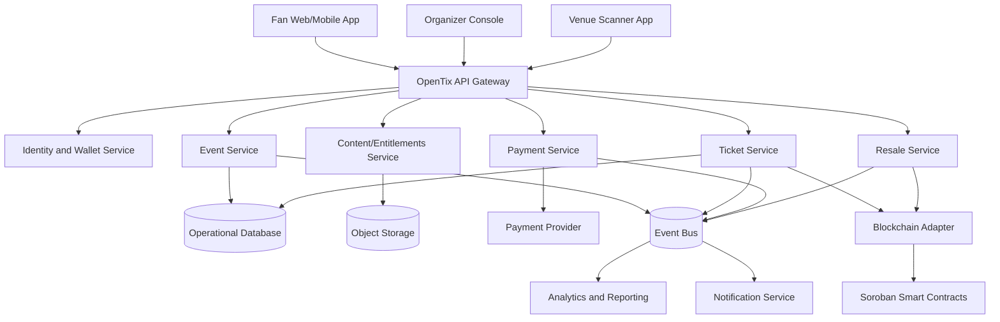
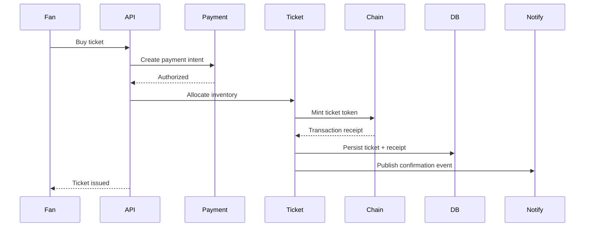

# OpenTix: Technical Architecture

**Document status:** Draft  
**Version:** 0.1  
**Last updated:** 2026-04-29  
**Related documents:** [04-smart-contract-design.md](04-smart-contract-design.md), [05-api-and-eventing.md](05-api-and-eventing.md), [06-data-model.md](06-data-model.md)

---

## 1. Architecture Principles

OpenTix is designed as a modular platform with explicit boundaries between user experience, event management, ticket ownership, payments, blockchain contracts, verification, and analytics. The following principles govern all design decisions:

- The fan-facing experience MUST remain as simple as conventional ticketing platforms.
- Blockchain complexity MUST be abstracted away from non-technical users.
- Smart contracts MUST be used only for state that derives meaningful value from shared, verifiable consensus.
- Private customer data MUST remain off-chain.
- Event and ticket state MUST be auditable.
- The system MUST be designed to handle high-volume traffic spikes associated with high-demand event on-sales.
- The platform MUST support organizers managing concurrent, large-scale event catalogs.

---

## 2. High-Level Architecture

---

## 3. Service Boundaries

### 3.1 API Gateway

The API Gateway provides the public request entry point, handling authentication, rate limiting, routing, and request normalization.

**Responsibilities:**

- Validate tokens and session credentials
- Apply per-tenant and per-endpoint rate limits
- Route requests to domain services
- Enforce organization and event authorization scopes
- Return consistent, machine-readable error shapes

### 3.2 Identity and Wallet Service

Manages user accounts, organizer accounts, wallet linking, custodial wallet provisioning, and presentation signing.

**Responsibilities:**

- User and organizer profile management
- Wallet address registration and linking
- Custodial wallet abstraction for non-technical users
- Role-based access control (RBAC)
- Session lifecycle management

### 3.3 Event Service

The authoritative data store for organizer-created event metadata.

**Responsibilities:**

- Organization and venue records
- Event and season catalog definitions
- Ticket tier configurations
- Event publish and unpublish lifecycle
- Event metadata validation

### 3.4 Ticket Service

Manages the operational ticket lifecycle from allocation through redemption.

**Responsibilities:**

- Ticket allocation and supply enforcement
- Mint transaction orchestration
- Ticket status and ownership cache
- Redemption state management
- Scanner validation flow execution

### 3.5 Blockchain Adapter

An isolation layer that decouples application services from chain-specific implementation details.

**Responsibilities:**

- Construct and sign Soroban transactions
- Submit and retry transactions with configurable back-off
- Read contract state with caching
- Normalize chain events to internal domain event types
- Emit internal ticket state change events

### 3.6 Payment Service

Handles payment authorization, capture, refunds, organizer payouts, and chargeback workflows.

**Responsibilities:**

- Fiat checkout via payment provider integration
- Crypto checkout (if supported in a given deployment)
- Payment intent lifecycle
- Refund policy enforcement
- Organizer payout scheduling
- Chargeback dispute handling

### 3.7 Resale Service

Coordinates secondary-market listing and atomic ownership transfer flows.

**Responsibilities:**

- Resale listing management
- Transfer eligibility verification
- Royalty calculation and routing
- Markup limit enforcement
- Buyer and seller settlement orchestration
- On-chain transfer invocation

### 3.8 Content and Entitlements Service

Controls access to premium files, video assets, images, sponsor content, and collectible metadata.

**Responsibilities:**

- Content upload and storage management
- Attaching content to events, tiers, or individual tickets
- Ownership verification prior to content delivery
- Signed download URL generation
- Post-event content archival

### 3.9 Notification Service

Delivers transactional notifications to buyers and organizers.

**Responsibilities:**

- Purchase and transfer confirmations
- Resale listing status updates
- Event reminders
- Scanner incident alerts

---

## 4. Frontend Architecture

The prototype is implemented in plain HTML, CSS, and JavaScript to remain portable and dependency-free. The production frontend SHOULD use a component-based framework appropriate to the team's expertise.

**Recommended production client applications:**

| Application | Primary Audience | Deployment Target |
|---|---|---|
| Fan App | Ticket buyers and event attendees | Web/PWA, mobile-first |
| Organizer Console | Event hosts and management teams | Desktop-first, web |
| Scanner App | Venue gate staff | Mobile-first, offline-capable |
| Content Manager | Organizers and creators | Web, event-scoped |

---

## 5. Recommended Technology Stack

| Layer | Recommendation | Rationale |
|---|---|---|
| Ticket, adapter, and validation services | Rust | High throughput, memory safety, deterministic latency |
| Business and organizer APIs | Rust or .NET 8 | Team discretion; strong type systems on both |
| Operational database | PostgreSQL | Relational integrity for inventory and ownership state |
| Verification and rate-limit cache | Redis | Low-latency ephemeral state |
| Event streaming | Kafka | Durable fan-out, replay, and analytics integration |
| Media and content storage | Object storage (e.g., S3-compatible) | Cost-effective blob storage with signed URL delivery |
| Programmable ownership and settlement | Soroban / Stellar | Smart contract enforcement of ticket rules |

---

## 6. Event-Driven Architecture

A durable event bus is essential because ticketing systems require reliable fan-out after state changes to multiple downstream consumers, including analytics, notifications, reconciliation workers, and blockchain adapters.

**Representative domain events:**

- `organization.created.v1`
- `event.created.v1`
- `event.published.v1`
- `ticket_tier.created.v1`
- `ticket.purchase_requested.v1`
- `payment.authorized.v1`
- `ticket.mint_requested.v1`
- `ticket.minted.v1`
- `ticket.transfer_requested.v1`
- `ticket.resold.v1`
- `ticket.redeemed.v1`
- `content.unlocked.v1`

## Transaction flow

## Data placement strategy

### On-chain

Only put state on-chain when shared verification matters.

Recommended on-chain state:

- Event contract identifier
- Ticket token identifier
- Current wallet owner
- Ticket status hash or compact enum
- Transfer policy reference
- Royalty policy
- Supply cap
- Mint/transfer/redeem events

### Off-chain

Keep sensitive, large, or changeable data off-chain.

Recommended off-chain state:

- User names and emails
- Payment records
- Venue staff permissions
- Content files
- Ticket artwork source files
- Analytics
- Detailed logs
- Support notes

## Scalability considerations

Ticket launches create bursty traffic. The architecture should handle spikes by separating purchase authorization, inventory allocation, and chain submission.

Recommended patterns:

- Pre-publish ticket tier inventory
- Use optimistic reservation windows
- Queue minting requests
- Use idempotency keys for purchase attempts
- Use outbox pattern for event publication
- Cache event pages aggressively
- Cache scanner validation rules locally before event starts

## Reliability considerations

- Payment capture and ticket minting must be reconciled.
- Chain submission must be idempotent.
- Failed mint jobs must be retryable.
- Scanner redemption must prevent double-entry.
- Offline scanner mode must reconcile conflicts safely.
- Event publishing should use transactional outbox.

## Deployment model

Recommended environments:

- Local development
- Preview/staging
- Production
- Chain testnet/sandbox
- Chain mainnet

Recommended deployment units:

- API Gateway
- Event Service
- Ticket Service
- Payment Service
- Resale Service
- Blockchain Adapter
- Notification Worker
- Scanner Validation API
- Analytics Consumer

## Observability

Minimum production telemetry:

- Purchase conversion funnel
- Payment authorization latency
- Minting latency
- Chain submission failures
- Scanner validation latency
- Failed scan reasons
- Double-scan attempts
- Inventory reservation conflicts
- Resale listing and transfer failures
- Event bus lag
