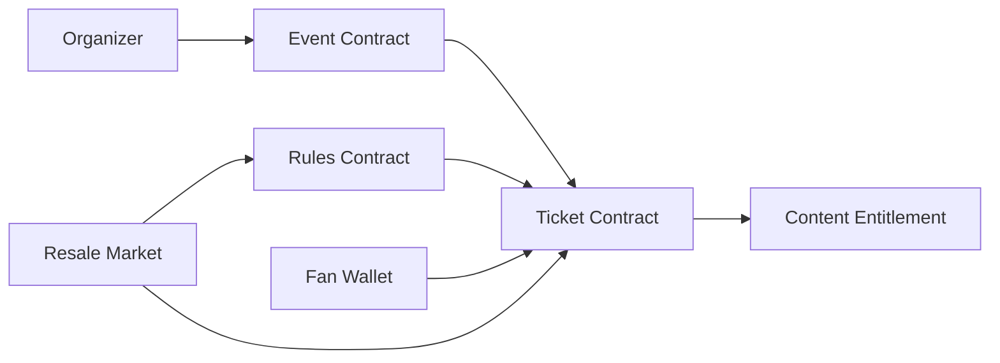

# OpenTix: Smart Contract Design

**Document status:** Draft  
**Version:** 0.1  
**Last updated:** 2026-04-29  
**Related documents:** [03-architecture.md](03-architecture.md), [07-security-and-trust.md](07-security-and-trust.md)

---

## 1. Purpose

Smart contracts in OpenTix enforce ticket ownership, supply constraints, transfer policies, and royalty distributions. Contracts are scoped to state that derives genuine value from shared, verifiable consensus. Private customer data, business logic that does not require on-chain verification, and mutable metadata that does not benefit from immutability are intentionally kept off-chain.

---

## 2. Contract Set

### 2.1 Event Contract

Represents a single event or season catalog on-chain.

**Responsibilities:**

- Store the organizer address and event identifier
- Maintain event lifecycle status: `draft`, `published`, `closed`, `canceled`
- Store per-tier supply caps and enforce minting authorization
- Emit verifiable event lifecycle records

### 2.2 Ticket Contract

Represents issued ticket tokens.

**Responsibilities:**

- Mint a ticket token to the buyer's wallet
- Store owner address, event identifier, tier identifier, and redemption state
- Execute transfers subject to the referenced rules contract
- Mark tickets as redeemed atomically and idempotently

### 2.3 Rules Contract

Encodes reusable transfer and resale policies that are referenced by ticket tiers.

**Responsibilities:**

- Define maximum resale markup in basis points
- Define organizer royalty percentage in basis points
- Define transfer window (start and end timestamps)
- Enforce non-transferable flag
- Store organizer royalty receiver address

### 2.4 Settlement Contract

Coordinates royalty distribution when a resale occurs on-chain.

**Responsibilities:**

- Calculate organizer royalty deterministically from the rules contract
- Route proceeds to the seller
- Route royalty to the organizer receiver address
- Emit a verifiable settlement event

### 2.5 Content Entitlement Contract *(optional)*

Provides on-chain proof of content access rights tied to valid ticket ownership.

**Responsibilities:**

- Verify that the presenting wallet holds a valid, unredeemed ticket
- Return a time-scoped entitlement proof
- Reference event-level and organization-level content identifiers

---

## 3. Contract Interaction Model



---

## 4. Dispatcher Pattern

A dispatcher architecture is a viable coordination layer for Soroban contracts when applied with appropriate discipline.

**Recommended dispatcher responsibilities:**

- Route request payloads to specific contract clients
- Validate the high-level request envelope structure
- Standardize tracing and audit metadata fields
- Standardize error code mapping

**Constraint:** The dispatcher MUST NOT own contract-specific validation logic or business rules. Each contract or contract client is responsible for its own invariant enforcement. The dispatcher coordinates; it does not govern.

---

## 5. Ticket Lifecycle

1. Event is created off-chain in the Event Service.
2. Event is registered to an on-chain Event Contract.
3. Ticket tier supply caps are initialized in the contract.
4. Fan completes purchase through the checkout flow.
5. Backend submits a mint transaction via the Blockchain Adapter.
6. Ticket Contract mints the ticket token to the buyer wallet.
7. Buyer presents ticket at the venue entry point.
8. Scanner validates owner identity and ticket state via the Ticket Service.
9. Ticket is marked redeemed atomically.
10. Ticket MAY persist as a post-event collectible if the organizer has enabled archival.

---

## 6. Core State Model

### 6.1 Event State

```rust
pub struct EventState {
    pub event_id: BytesN<32>,
    pub organizer: Address,
    pub status: EventStatus,
    pub royalty_receiver: Address,
    pub created_at: u64,
    pub updated_at: u64,
}
```

### 6.2 Ticket State

```rust
pub struct TicketState {
    pub ticket_id: BytesN<32>,
    pub event_id: BytesN<32>,
    pub tier_id: BytesN<32>,
    pub owner: Address,
    pub status: TicketStatus,
    pub rule_id: BytesN<32>,
    pub minted_at: u64,
}
```

### 6.3 Transfer Rule State

```rust
pub struct TransferRule {
    pub rule_id: BytesN<32>,
    pub max_markup_bps: u32,
    pub royalty_bps: u32,
    pub transferable: bool,
    pub resale_starts_at: Option<u64>,
    pub resale_ends_at: Option<u64>,
}
```

---

## 7. Security Requirements

- Only the organizer or an authorized operator address MAY publish event or tier state.
- Only the designated mint authority MAY mint primary-sale tickets.
- Minting MUST respect configured tier supply caps without exception.
- Redemption MUST be idempotent; duplicate redemption attempts MUST be rejected.
- Transfer execution MUST be gated by the referenced rules contract.
- Resale royalties MUST be calculated deterministically from the on-chain rule state.
- Contract upgrades MUST be governed via a defined process and emitted as observable events.
- An emergency pause capability MUST exist, scoped to individual events to limit blast radius.

---

## 8. Design Trade-offs: On-Chain Metadata Strategy

### Option A: Fully On-Chain Ticket Metadata

| Dimension | Assessment |
|---|---|
| Transparency | High — any party can independently verify ticket details |
| External verifiability | High — no off-chain dependency for basic reads |
| Storage cost | High — all metadata consumes ledger resources |
| Privacy | Low — all ticket data is publicly visible |
| Mutability | Low — corrections and updates are expensive or impossible |
| Media assets | Not viable — large assets cannot be stored on-chain |

### Option B: Hybrid Model *(recommended)*

| Dimension | Assessment |
|---|---|
| Sensitive data isolation | High — PII and payment data remain off-chain |
| Metadata flexibility | High — off-chain records can be updated without contract interaction |
| On-chain footprint | Minimal — chain stores only ownership tokens and rule references |
| Cost | Low — reduced ledger writes |
| Off-chain integrity | Required — off-chain records must be secured and reconciled with chain state |
| Reconciliation burden | Moderate — ownership cache must be periodically validated against the contract |

**Recommended approach:** Hybrid model. The chain is the authoritative source for ownership and rule enforcement. Off-chain systems are authoritative for event metadata, customer identity, and payment records.

---

## 9. Contract Events

All significant state transitions MUST emit observable contract events:

- `event_registered`
- `event_published`
- `tier_created`
- `ticket_minted`
- `ticket_transferred`
- `ticket_resold`
- `ticket_redeemed`
- `ticket_canceled`
- `rule_updated`
- `royalty_paid`

---

## 10. Upgrade Strategy

Contract upgrades in a production ticketing system carry significant risk and MUST be approached conservatively.

**Recommended approach:**

- Ticket ownership records SHOULD be immutable where technically feasible.
- Rules contracts SHOULD be versioned; new versions do not affect existing bindings.
- New events SHOULD reference the current contract version; existing events remain bound to the version active at publication.
- Any migration from an older contract version MUST produce a complete, reviewable audit report before execution.
- Emergency pause capability MUST be scoped to individual events, not the entire contract, to prevent unnecessary disruption.
