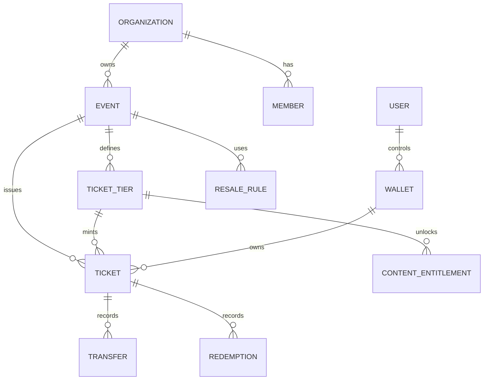

# OpenTix: Data Model

**Document status:** Draft  
**Version:** 0.1  
**Last updated:** 2026-04-29  
**Related documents:** [03-architecture.md](03-architecture.md), [05-api-and-eventing.md](05-api-and-eventing.md), [07-security-and-trust.md](07-security-and-trust.md)

---

## 1. Entity Overview

---

## 2. Core Tables

### 2.1 `organizations`

| Column | Type | Notes |
|---|---|---|
| id | uuid | Primary key |
| name | text | Display name |
| slug | text | Public route |
| status | text | active, suspended, deleted |
| payout_account_id | text | Payment provider reference |
| created_at | timestamp | Creation time |
| updated_at | timestamp | Last update |

### 2.2 `organization_members`

| Column | Type | Notes |
|---|---|---|
| organization_id | uuid | Organization |
| user_id | uuid | User |
| role | text | owner, admin, staff, scanner |
| created_at | timestamp | Creation time |

### 2.3 `events`

| Column | Type | Notes |
|---|---|---|
| id | uuid | Primary key |
| organization_id | uuid | Owner |
| season_catalog_id | uuid nullable | Optional parent catalog |
| name | text | Event name |
| category | text | Music, sports, conference, etc. |
| venue_name | text | Venue |
| starts_at | timestamp | Start time |
| ends_at | timestamp | End time |
| status | text | draft, published, closed, canceled |
| chain_event_id | text nullable | Contract identifier |
| created_at | timestamp | Creation time |
| updated_at | timestamp | Last update |

### 2.4 `ticket_tiers`

| Column | Type | Notes |
|---|---|---|
| id | uuid | Primary key |
| event_id | uuid | Event |
| name | text | General, Premium, VIP |
| price_cents | bigint | Face value |
| currency | text | USD, USDC, etc. |
| supply_cap | int | Max tickets |
| remaining_supply | int | Operational cache |
| rule_id | uuid | Transfer/resale rule |
| template_id | uuid nullable | Ticket visual template |
| created_at | timestamp | Creation time |

### 2.5 `tickets`

| Column | Type | Notes |
|---|---|---|
| id | uuid | Internal ticket id |
| event_id | uuid | Event |
| tier_id | uuid | Ticket tier |
| owner_wallet_id | uuid | Current owner cache |
| status | text | minted, redeemed, canceled, frozen |
| chain_ticket_id | text | On-chain ticket token id |
| mint_tx_hash | text | Chain receipt |
| purchased_at | timestamp | Purchase time |
| redeemed_at | timestamp nullable | Redemption time |

### 2.6 `resale_rules`

| Column | Type | Notes |
|---|---|---|
| id | uuid | Primary key |
| organization_id | uuid | Owner |
| transferable | bool | Can transfer |
| resale_allowed | bool | Can list for resale |
| max_markup_bps | int | Basis points above face value |
| royalty_bps | int | Organizer royalty |
| resale_starts_at | timestamp nullable | Start window |
| resale_ends_at | timestamp nullable | End window |
| chain_rule_id | text nullable | Contract reference |

### 2.7 `transfers`

| Column | Type | Notes |
|---|---|---|
| id | uuid | Primary key |
| ticket_id | uuid | Ticket |
| from_wallet_id | uuid | Previous owner |
| to_wallet_id | uuid | New owner |
| transfer_type | text | gift, resale, admin |
| price_cents | bigint nullable | Required for resale |
| royalty_cents | bigint nullable | Required for resale |
| tx_hash | text nullable | Chain receipt |
| created_at | timestamp | Creation time |

### 2.8 `redemptions`

| Column | Type | Notes |
|---|---|---|
| id | uuid | Primary key |
| ticket_id | uuid | Ticket |
| event_id | uuid | Event |
| scanner_device_id | uuid | Device |
| decision | text | allow, deny, review |
| reason | text | Decision reason |
| redeemed_at | timestamp | Time |

### 2.9 `content_entitlements`

| Column | Type | Notes |
|---|---|---|
| id | uuid | Primary key |
| event_id | uuid | Event |
| tier_id | uuid nullable | Optional tier restriction |
| ticket_id | uuid nullable | Optional specific ticket |
| content_id | uuid | Content item |
| access_policy | text | owner_only, post_event, permanent |

---

## 3. Required Indexes

The following indexes MUST be created to support query patterns at production scale:

- `events(organization_id, status, starts_at)`
- `ticket_tiers(event_id)`
- `tickets(event_id, status)`
- `tickets(owner_wallet_id, status)`
- `tickets(chain_ticket_id)`
- `transfers(ticket_id, created_at)`
- `redemptions(event_id, scanner_device_id, redeemed_at)`
- `resale_rules(organization_id)`

---

## 4. Consistency Requirements

- Ticket tier supply MUST NOT be oversold under any concurrent purchase scenario. Supply enforcement requires optimistic locking or a serialized allocation step.
- Payment authorization and ticket minting MUST be reconciled. Any minting failure following a successful payment MUST trigger a compensation workflow.
- The off-chain ownership cache MUST be periodically reconciled against on-chain contract state.
- Ticket redemption MUST be idempotent; duplicate redemption attempts within any session MUST return the original decision without re-executing the redemption.
- Resale transfers MUST atomically update owner records and settlement state at the application level.
- Event cancellation MUST immediately block new purchases and trigger the applicable refund workflow.

---

## 5. Privacy Model

Private user data MUST NOT be written to any on-chain contract. Wallet addresses may be pseudonymous depending on chain configuration, but all of the following MUST remain exclusively in off-chain, access-controlled storage:

- User identity (name, email, phone)
- Payment records and instrument references
- Support history
- Internal audit logs containing PII
